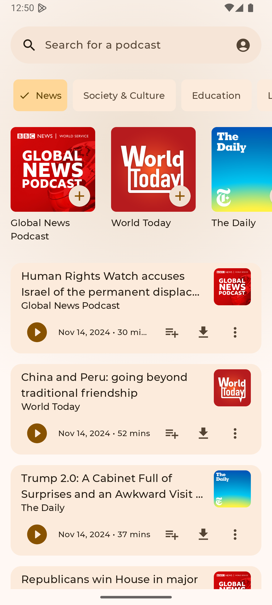
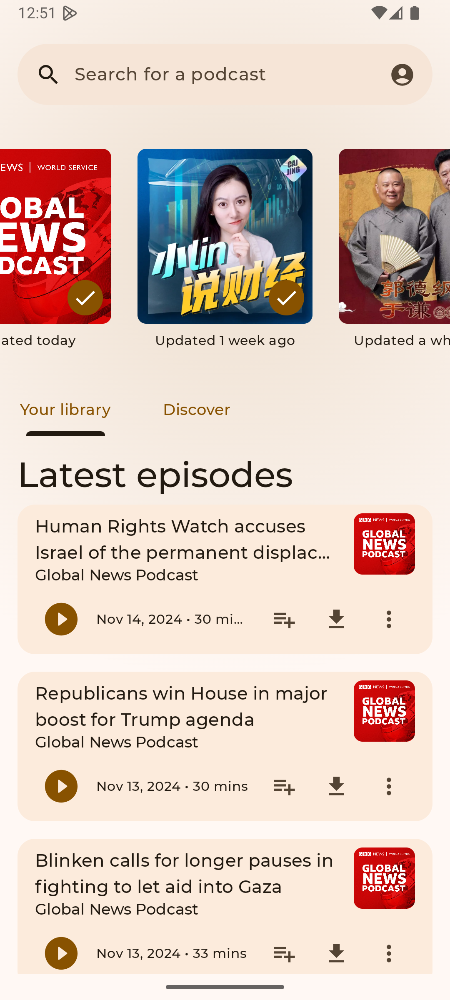
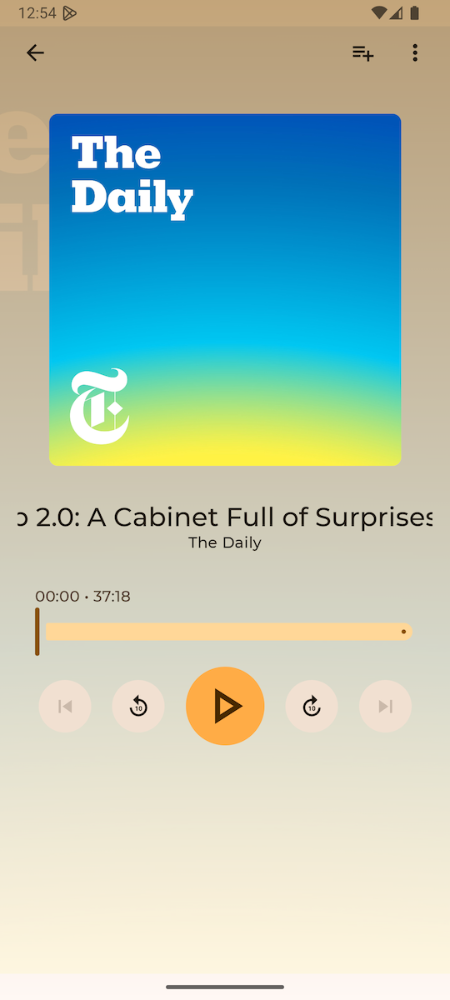
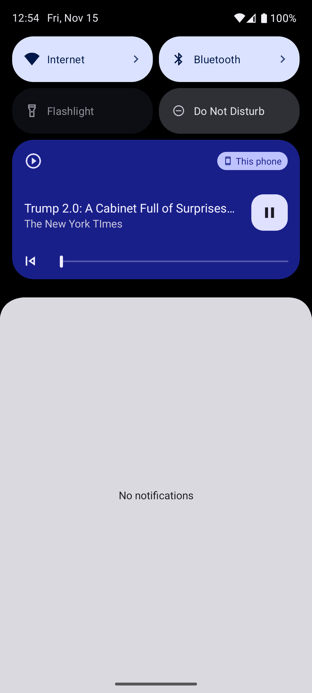

## Project Structure

- UI Layer: Includes Podcast list, Episode list, and playback controls.

- Network Layer: Uses OkHttp for API requests.

- Data Layer: Utilizes Room for persistent storage and data updates.

- Audio Playback: Implements ExoPlayer to play content, supporting background playback.

- RSS Parsing: Uses Rome to parse data from podcast subscription feeds.

## 项目结构

- UI层：包括 Podcast 列表、Episode 列表以及播放控件。

- 网络层：使用 OkHttp 进行 API 请求。

- 数据层：使用 Room 作为持久存储，更新数据。

- 音频播放：通过 ExoPlayer 播放内容，并支持后台播放。

- RSS解析：使用 Rome 从播客订阅源中解析数据。

## Branches

main - release app

develop - developer merge branch to develop

## Home Screen

## Detail Screen

## Home Screen Library

## Play Screen

## Notification Player

