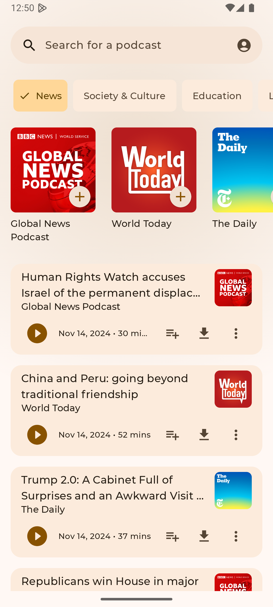
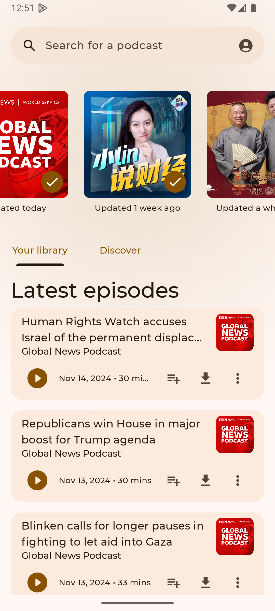
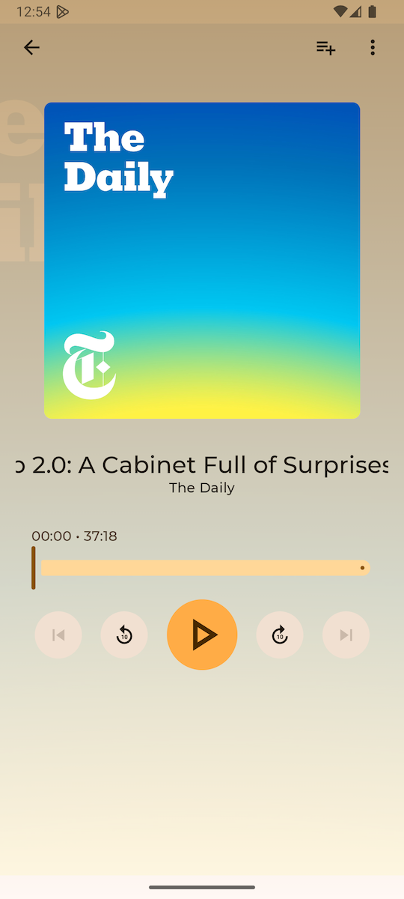
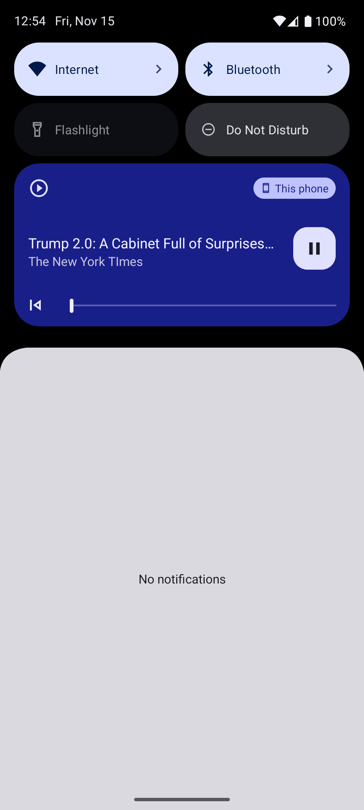

# Project

BidoneTestCast

## Libraries

This project uses a modern Android tech stack with several powerful third-party and Jetpack libraries. Here is a curated list of the essential libraries integrated into BidoneTestCast:

### Core & Architecture

- Dagger Hilt: A pragmatic dependency injection library for Android that reduces the boilerplate of manual DI.
- Kotlinx Coroutines: Used for managing background tasks and asynchronous programming with a focus on structured concurrency.
- Kotlinx Immutable Collections: Provides efficient immutable collection implementations to ensure state consistency in the UI.

### UI & Design System

- Jetpack Compose: The modern toolkit for building native UI, used extensively throughout the project.
- Accompanist: A group of libraries providing features like Adaptive Layouts that supplement Jetpack Compose.
- Coil: An image loading library for Android backed by Kotlin Coroutines.
- AndroidX Palette: Used for extracting prominent colors from images to dynamically style the UI.

### Media & Data

- Media3 / ExoPlayer: The standard for high-performance media playback on Android, handling podcast streaming.
- Rome: A set of open-source Java tools for parsing RSS and Atom feeds.
- Room: A persistence library that provides an abstraction layer over SQLite for robust database access.

### Widgets

- Jetpack Glance: A framework built on top of Jetpack Compose that allows building App Widgets for the home screen using Compose-like syntax.

### Testing

- MockK: A powerful mocking library specifically designed for Kotlin.
- Turbine: A small library for testing Kotlin Flows.
- JUnit 4: The foundation for running unit tests.
- Robolectric: A framework that allows running Android tests directly on the JVM.
- Roborazzi: Used for UI screenshot testing.

## Project Structure

- **UI Layer**: Includes Podcast lists, Episode lists, and playback controls.
- **Network Layer**: Uses OkHttp for API requests.
- **Data Layer**: Uses Room as persistent storage to manage and update data.
- **Audio Playback**: Powered by ExoPlayer, supporting both foreground and background playback.
- **RSS Parsing**: Uses Rome to parse and extract data from podcast RSS feeds.

## Features

- ✅ **Podcast Discovery**: Browse and discover podcasts from various RSS feeds.
- ✅ **Category Filtering**: Filter podcasts by specific categories for a personalized experience.
- ✅ **Advanced Audio Player**: High-performance playback with support for background audio and notifications.
- ✅ **Personal Library**: Subscribe to podcasts and manage your own collection.
- ✅ **Search**: Quickly find podcasts and episodes using a robust search feature.
- ✅ **Adaptive UI**: Responsive layouts designed for phones, tablets, and foldable devices.
- ✅ **Offline Support**: Metadata persistence using Room for a seamless offline experience.
- ✅ **Material 3 Design**: A modern, dynamic UI utilizing Material You and Palette for color extraction.

## To-do List

- ⏰ **Offline-First Architecture**: Further implement a robust offline-first Android architecture.
- ⏰ **Optimize First-Launch Loading**: Improve data loading speed when the app is opened for the first time.
- ⏰ **Enhance Search**: Refine and expand the search functionality for better results.
- ⏰ **Improve Playback**: Add more advanced playback features and stability.
- ⏰ **Expand Unit Testing**: Increase unit test coverage and refine existing tests.
- ⏰ **Home Screen Widget**: Stay connected with your favorite podcasts via a Jetpack Glance widget.

## ScreenShots

  
  
  

  
  

## 项目结构

- UI层：包括 Podcast 列表、Episode 列表以及播放控件。

- 网络层：使用 OkHttp 进行 API 请求。

- 数据层：使用 Room 作为持久存储，更新数据。

- 音频播放：通过 ExoPlayer 播放内容，并支持后台播放。

- RSS解析：使用 Rome 从播客订阅源中解析数据。

## Branches

main - release app

develop - developer merge branch to develop

## Home Screen

## Detail Screen

## Home Screen Library

## Play Screen

## Notification Player

